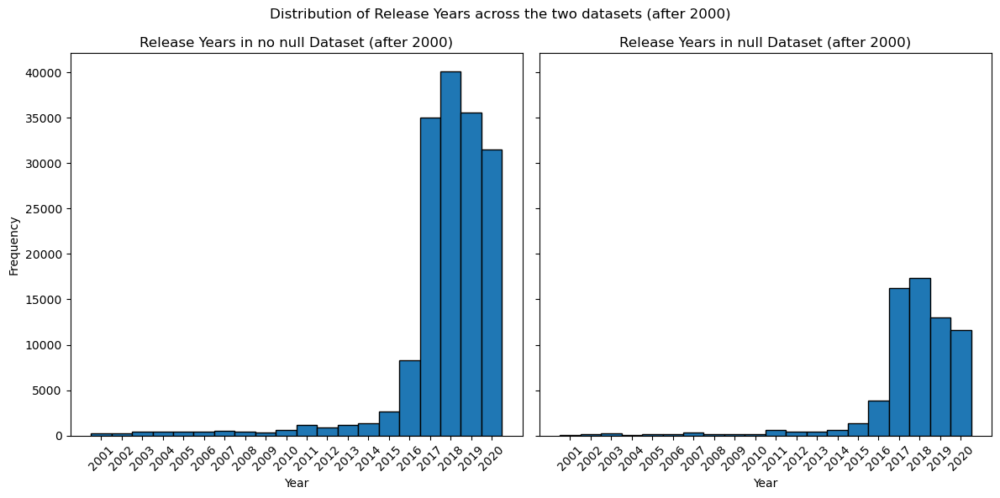

# Project of Data Visualization (COM-480)
## Group Data Viz Wizards

| Student's name | SCIPER |
| -------------- | ------ |
| Levin Hertrich| 387376|
| Yassine Turki| 344704|
| Kirill Zemlianskii | 395871 |

[Milestone 1](#milestone-1) • [Milestone 2](#milestone-2) • [Milestone 3](#milestone-3)

## Milestone 1 (21st March, 5pm)

### Dataset

In this project, we analyze global music trends using the [Spotify HUGE database](https://www.kaggle.com/datasets/pepepython/spotify-huge-database-daily-charts-over-3-years) from Kaggle. This dataset contains all the songs in Spotify’s Daily Top 200 charts in 35+1 (global) countries around the world in the years from 2017-2020 . We focus on the `Final Database.csv` file, which contains 151 attributes and 170,633 rows, refining it through Exploratory Data Analysis (EDA). The dataset has 151 columns, which is too much for a meaningful analysis and visualization. Additionally we have to ensure that all columns have the expected datatype and that not too many values are missing, especially in the most important columns. Therefore we perform the following steps:

- Dropping columns: Identifying and removing columns that are not relevant for the analysis and visualization, especially the one-hot encoding of categorial variables
- Date conversion: Converting the release date attribute to datetime
- Check for missing values: Checking for columns with missing values and the percentage of missing values in these columns. Fortunately, in each column there are not more than 50% missing values and the most important columns don’t have any missing values

### Problematic

Music plays an important role in most peoples lives. It motivates, helps in difficult times and makes the best moments even more beautiful. The important role of music is reflected in the Spotify charts, they show what songs are most popular at the moment and which artists are on the rise. But why are certain songs and artists more popular than others? How does this differ between countries and which role does genre play? In this project we want to answer these questions and explore and visualize the data behind the Spotify charts. Therefore we want to explore the following topics:
- Geographical Trends: Identify popular songs and genres
across countries
- Artist Comparison: Analyze artists by genre, popularity, and
followers
- Musical Composition: Examine song attributes like instrumentalness, speechiness, and liveliness
- Artist Evolution: Track changes in musical style over time
- Popularity Trends: Visualize the evolution of music genres
using time series analysis
- Actuality: Discover how long songs can stay in the charts after their release

### Exploratory Data Analysis

Because the orignial dataset contains *150* columns which is too much for our visualization we first focused on dropping columns. We found a lot of the columns were one-hot encoded features which are not necessary for visualization so we dropped these columns which resulted in *79* columns. 

After converting the `Release_date` attribute to datetime we focused on missing values. We found that there are basically two sorts of columns: One where less than 1% of values are missing and one where around 58% of values are missing, where all these columns have the missing values in the same rows. To minimize our data loss we decided to create two datasets:
- No null Dataset: This dataset contains all columns where (nearly) no values are missing so that only a few rows have to be dropped. Whenever possible we will use this dataset for visualizations to minimize dataloss and make our analyses and visualizations as accurate as possible
- Null Dataset: This dataset contains all columns and rows with missing values are dropped, resulting in a dataloss of roughly 60% of our original data. Despite this dataloss the dataset still contains around *70.000* rows which should be sufficient for meaningful analyses and visualizations. We will use this dataset whenever we need values from columns with missing values


For both datasets we calculated the following basic statistics:
| Attribute | No null Dataset | Null Dataset |
| -------------- | ------ | ---- |
| Number of rows | 167,356 | 69,875 |
| Number of columns | 33 | 79 |
| Number of unique countries | 35 | 35 |
| Number of unique artists | 25,063 | 5,332 |
| Number of unique albums | 33,803 | 5,921 |
| Number of unique genres | 1,099 | 527 |
| Average artist followers | 8,544,889 | 12,653,714 |
| Average popularity | 5,476 | 5,725 |
| Average duration (ms) | 206,392 | 207,135 |
| Proportion of explicit songs | 36.8% | 39.5% |
| Average days since release | 1,338 | 1,459 |


Additionally we plotted the distribution of the release year of the songs in both datasets after the year 2000 as most of the songs are released after this date:




We can see that in both datasets the distribution of the release year is similar and very dense around the years 2017-2020. This is expected as we are looking at the Spotify Charts during this time period and gives a first hint, that songs are probably in the charts soon after they have been released.

We also plot the top 10 artists, songs, and genres in terms of popularity. We extend our EDA by analyzing the corelation of our features. More detail is found in the notebook `eda.ipynb`.


### Related work
This dataset has previously been explored by several users on the Kaggle platform. However, these analyses primarily focus on basic EDA and present static visualizations. There are some projects on similar music-related data such as [1](https://public.tableau.com/app/profile/anne.bode/viz/SpotifyPREMIUMDashboard/PremiumDashboard), [2](https://medium.com/@shrunalisalian97/spotify-data-visualization-4c878c8114e), and [3](https://www.brandonlu.com/spotify-data-project). These projects serve as a basic inspiration for our ideas, yet they generally remain static or limited in interactive elements. 

We aim to present various music attributes in an entertaining yet insightful manner, significantly enhancing user engagement and data comprehension. We draw inspiration from several visualizations outside the music domain. For instance, the interactive world map provided by Google Trends demonstrates an effective way of presenting geographically linked information. We plan to adopt this method to visualize music interests across different regions. The visualization from Our World in Data, showcases stacked histograms which we plan to adapt to demonstrate evolving trends in music attributes over time.

## Milestone 2 (18th April, 5pm)

Deliverables for Milestone 2 are in the `Milestone_2.pdf` on the root level of the repository.


Skeleton Website: https://com-480-data-visualization.github.io/data_viz_wizards/


## Milestone 3 (30th May, 5pm)

**80% of the final grade**


## Late policy

- < 24h: 80% of the grade for the milestone
- < 48h: 70% of the grade for the milestone

# Spotify Data Visualization

This project visualizes Spotify music data across different countries, showing popularity of genres, artists, and songs worldwide.

## Prerequisites

- Node.js (version 14 or higher)
- npm (comes with Node.js)

## Installation

1. Clone the repository:
```bash
git clone <repository-url>
cd data_viz_wizards
```

2. Install dependencies:
```bash
npm install
```

This will install all required packages including:
- React
- D3.js
- TopoJSON
- Vite (development server)

## Running the Application

1. Start the development server:
```bash
npm run dev
```

2. Open your browser and navigate to:
```
http://localhost:5173
```

## Project Structure

- `src/components/` - React components
  - `MapPlot.jsx` - World map visualization
  - `CountryStatistics.jsx` - Country-specific statistics
  - `ArtistComparison.jsx` - Artist comparison visualization
  - `Navigation.jsx` - Navigation between views
- `src/App.jsx` - Main application component
- `src/main.jsx` - Application entry point
- `src/index.html` - HTML template
- `src/App.css` - Main styles
- `src/index.css` - Global styles

## Features

- Interactive world map showing music popularity
- Country-specific statistics
- Artist comparison tool
- Filter by genre, artist, or song
- Responsive design

## Data Sources

The application uses data from:
- Spotify API
- World Atlas TopoJSON data
